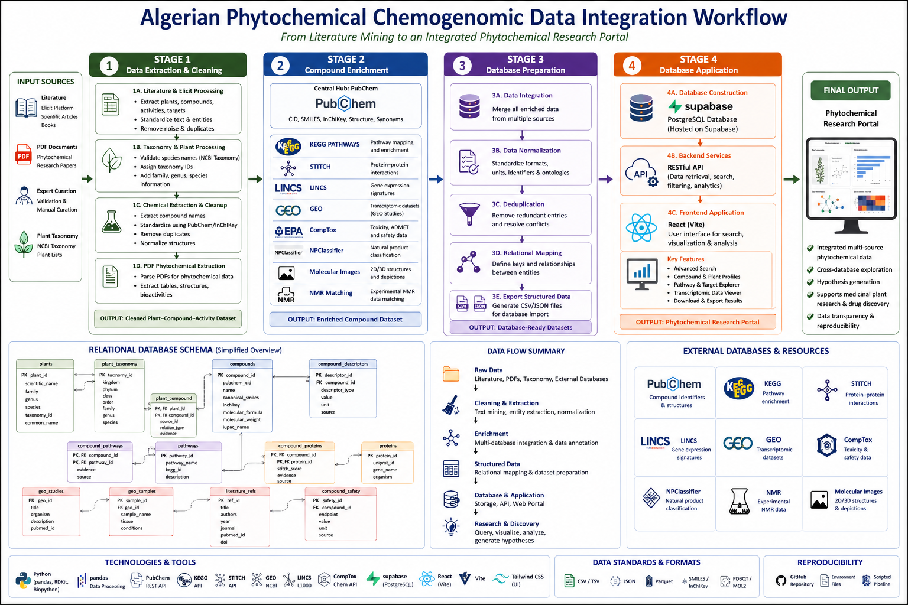

# Algerian Phytochemical Chemogenomic Portal

An integrated chemogenomic database and research platform dedicated to Algerian medicinal plants, linking phytochemical compounds, molecular targets, transcriptomic signatures, pathways, diseases, toxicity data, and literature evidence into a unified scientific knowledge system.

The platform integrates large-scale biological databases with curated phytochemical datasets to support medicinal plant research, chemogenomics, natural product discovery, and computational pharmacology.

---

# Project Overview

This project builds a multi-stage computational pipeline designed to extract, normalize, enrich, and integrate phytochemical and biological data into a structured database and interactive web platform.

The portal combines:

* Algerian plant biodiversity
* phytochemical compounds
* molecular targets
* biological pathways
* transcriptomic signatures
* disease associations
* toxicity profiles
* ethnomedicinal knowledge
* scientific literature evidence

---

<p align="center">
  
</p>

<p align="center">
  <i>Computational workflow of the Algerian Phytochemical Chemogenomic Portal.</i>
</p>

---

# Workflow

The project follows a complete computational chemogenomic workflow:

## Stage 1 — Data Extraction

* Elicit processing
* taxonomy enrichment
* genus processing
* chemical cleanup
* PDF phytochemical extraction

## Stage 2 — Compound Enrichment

* PubChem identifiers
* KEGG pathways
* STITCH interactions
* LINCS signatures
* GEO datasets
* CompTox toxicity data
* NPClassifier annotations
* molecular structures
* NMR metadata

## Stage 3 — Database Preparation

* data normalization
* relational formatting
* structured CSV generation
* evidence integration

## Stage 4 — Database Construction

* Supabase PostgreSQL integration
* FastAPI backend
* React frontend
* API deployment
* analytics integration

---

# What This Project Does

This platform provides a complete workflow to:

1. Extract phytochemical compounds from scientific literature
2. Normalize plant taxonomy and chemical identities
3. Enrich compounds using multiple biological databases
4. Generate structured datasets for relational database integration
5. Build transcriptomic and chemogenomic associations
6. Provide a web-based scientific exploration portal
7. Support community curation and future database expansion

---

# Scientific Features

## Biodiversity & Ethnomedicine

* Algerian medicinal plant taxonomy
* Regional and endemic species tracking
* Traditional medicinal uses
* Ethnopharmacological evidence

## Chemistry & Toxicity

* Phytochemical structures
* Molecular descriptors
* Compound identifiers and synonyms
* Toxicity endpoints
* Safety assessments
* Structure files (PDB/SDF)

## Chemogenomics

* Gene-compound interactions
* Transcriptomic signatures
* LINCS and GEO integration
* Molecular target associations

## Pathways & Diseases

* Disease-compound relationships
* Pathway enrichment
* Gene-pathway mappings
* Therapeutic associations

## Interactive Web Portal

* Plant Explorer
* Compound Explorer
* Disease Browser
* Search Engine
* Coverage Dashboard
* Analytics System
* Community Curation Interface
* Knowledge Graph Exploration

---

# Repository Structure

```text
project/
├── backend/
│   ├── api/
│   ├── etl/
│   ├── graph/
│   ├── main.py
│   ├── database.py
│   └── requirements.txt
│
├── scripts/
│   ├── stage01_elicit_processing/
│   ├── stage01b_genus_processing/
│   ├── stage01b_taxonomy/
│   ├── stage01c_chemical_cleanup/
│   ├── stage01d_pdf_phytochemical_extraction/
│   ├── stage02_compound_enrichment/
│   ├── stage03_database_preparation/
│   └── stage04_database_construction/
│
├── src/
│   ├── components/
│   ├── pages/
│   ├── lib/
│   └── main.tsx
│
├── public/
│   └── optimized_images/
│
├── supabase/
│   └── migrations/
│
└── data/
    ├── stage5_database_ready/
    ├── stage6_curation/
    ├── stage7_final_curation/
    ├── structures/
    └── plant_images/
```

---

# Architecture

The platform combines:

* PostgreSQL relational database via Supabase
* FastAPI backend API
* React + Vite frontend
* ETL scientific pipelines
* Optional Neo4j knowledge graph integration

---

# Technologies

## Backend

* Python
* FastAPI
* PostgreSQL
* Supabase
* Neo4j (optional)

## Frontend

* React
* TypeScript
* Vite

## Scientific Stack

* Pandas
* NumPy
* RDKit
* PubChem API
* KEGG
* STITCH
* GEO
* LINCS
* CompTox

---

# Installation

## Clone Repository

```bash
git clone <repository-url>
cd project
```

## Frontend Installation

```bash
npm install
```

## Backend Installation

```bash
cd backend
pip install -r requirements.txt
```

---

# Environment Variables

Create `.env` files and configure:

```env
SUPABASE_URL=
SUPABASE_KEY=
SUPABASE_SERVICE_KEY=
OPENAI_API_KEY=
NEO4J_URI=
NEO4J_USER=
NEO4J_PASSWORD=
```

---

# Running the Application

## Frontend

```bash
npm run dev
```

## Backend

```bash
cd backend
uvicorn main:app --reload --host 0.0.0.0 --port 8000
```

---

# Production Deployment

## Frontend

* Netlify deployment

## Backend

* Render deployment

## Database

* Supabase PostgreSQL

---

# API Endpoints

## Plants

* `/api/plants`
* `/api/plants/{id}`
* `/api/plants/{id}/compounds`

## Compounds

* `/api/compounds`
* `/api/compounds/{id}`

## Diseases

* `/api/diseases`

## Search

* `/api/search`

## Analytics

* `/api/analytics`

## Knowledge Graph

* `/api/graph`

## Chatbot

* `/api/chat`

API documentation:

```text
/api/docs
```

---

# Knowledge Graph Integration

Optional Neo4j integration enables:

* plant-pathway exploration
* disease-target mapping
* compound relationship analysis
* similarity networks
* biological interaction visualization

---

# Community Curation

The platform supports future collaborative curation including:

* plant-compound submissions
* literature evidence additions
* toxicity annotations
* transcriptomic evidence integration

---

# Scientific Contribution

This project contributes to:

* Algerian biodiversity valorization
* medicinal plant research
* chemogenomic integration
* natural product discovery
* computational pharmacology
* AI-assisted phytochemical analysis

The platform is intended to support researchers working in:

* medicinal chemistry
* pharmacognosy
* bioinformatics
* systems biology
* chemoinformatics
* natural products research

---

# Data Access

Large datasets and raw scientific files are not included in this repository.

Optimized assets and processed datasets are used for deployment efficiency.

---

# Image Sources and Attribution

Plant images used in this project were programmatically collected using the Global Biodiversity Information Facility (GBIF) API.

Image retrieval pipeline:

* GBIF occurrence records
* publicly accessible biodiversity media
* automated scientific name matching

Original image ownership and copyrights remain with their respective contributors and providers referenced through GBIF.

GBIF:
https://www.gbif.org/

Example retrieval method used in the project:

* GBIF occurrence search API
* scientificName-based querying
* biodiversity media extraction

---

# Institution

## Floret Center for Advanced Genomics and Computational Biology

This project was developed within the scientific and computational research activities of the:

### **Floret Center for Advanced Genomics and Computational Biology**

focused on:

* computational biology
* chemogenomics
* medicinal plant research
* bioinformatics
* AI-assisted natural product discovery

---

# License

MIT License

---

# Citation

If you use this platform in research, please cite:

```text
Algerian Phytochemical Chemogenomic Portal
Floret Center for Advanced Genomics and Computational Biology
2025
```

---

# Acknowledgments

This project integrates or references data from:

* PubChem
* ChEMBL
* KEGG
* STITCH
* LINCS
* GEO
* CompTox
* Reactome
* MeSH
* GBIF

as well as curated ethnopharmacological knowledge related to Algerian medicinal plants.

---

# Contact and Scientific Inquiries

For collaboration, scientific contribution, or research inquiries:

### Email

* [imene.maallem@floretcenter.org](mailto:imene.maallem@floretcenter.org)
* [imene.maallem@yahoo.com](mailto:imene.maallem@yahoo.com)

### Research Areas

* chemogenomics
* phytochemistry
* medicinal plants
* computational pharmacology
* bioinformatics
* natural product discovery

### Institution

Floret Center for Advanced Genomics and Computational Biology
